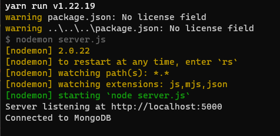
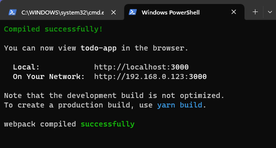
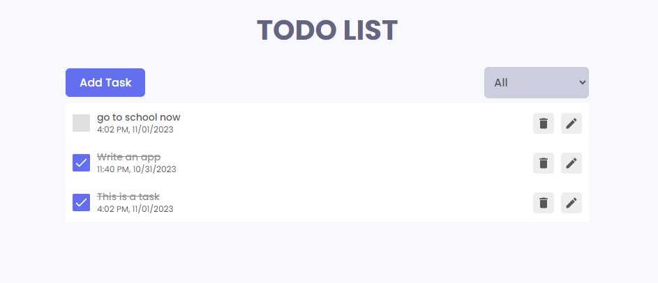

# Hi, I'm Rehan! 👋  
                
## 🚀 About Me  
I'm a Software Engineer ...  
    
## 🔗 Links  
   
    
## 🛠 Skills  
JavaScript, TypeScript, React, Node.js, MongoDb...
  

# Todo app with react and node 📝  
CRUD operation with MongoDB complete front-end and backed application with redux implementation and `localStorage` sync  

  

## Tech Stack  

**Client:** React, Redux, SCSS  

**Server:** Node, Express, MongoDb

## Run Locally  
Clone the project  

## Environment Variables  

To run this project, you will need to add the following environment variables to your .env file  
`MONGO_USERNAME`  

`MONGO_PASSWORD`  

Clone the project  

~~~bash  
  git clone https://github.com/mr-muhammad-rehan/react-todo-app.git
~~~

Go to the project directory  

~~~bash  
  cd react-todo-app
~~~

Install dependencies  
For both React and node.js install modules separately 
~~~bash  
cd todo-app-react
yarn install

cd..
cd todo-server-node
yarn install
~~~

Start the server  
For both React and node.js start projects separately (in separate terminals)
~~~bash  
yarn start
~~~

## Screenshots  

 

## Contributing  

Contributions are always welcome!  

Please adhere to this project's `code of conduct`.  

## License  

[MIT](https://choosealicense.com/licenses/mit/)

 
  